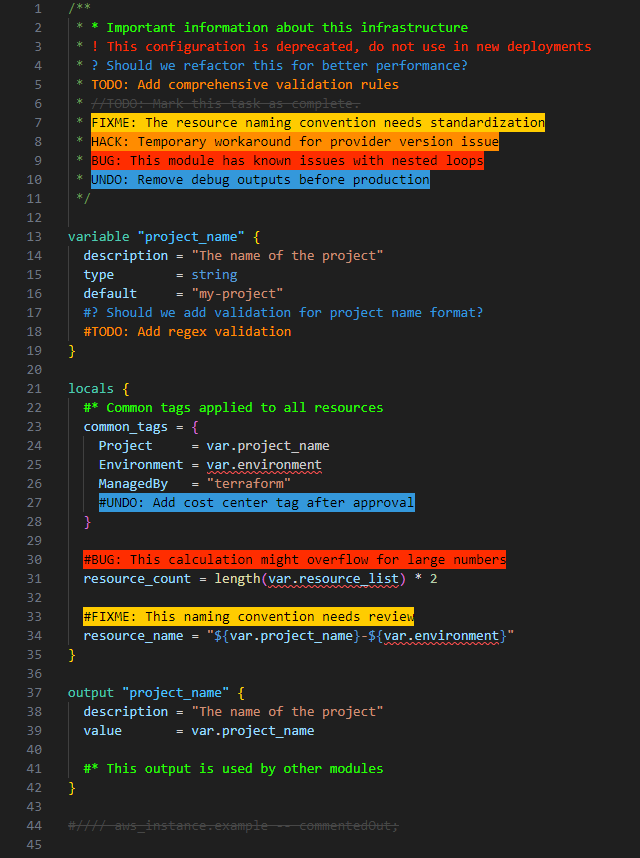

# Better Byte

**Better Byte** highlights and color-codes your comments to make them instantly recognizable and actionable.

**Categorize your comments with:**
- **Alerts** (red) - Important warnings and critical information
- **Queries** (blue) - Questions and things to investigate  
- **TODOs** (orange) - Tasks that need to be completed
- **Highlights** (green) - Important information and notes
- **FIXME** (yellow background) - Issues that need fixing
- **HACK** (orange background) - Temporary workarounds
- **BUG** (red background) - Known bugs and issues
- **UNDONE** (blue background) - Things to be removed/reverted
- **Commented-out code** (gray strikethrough) - Code that you're scared to delete

**Works with:** OpenTofu, YAML, JSON, Python, Terraform, TypeScript, and 50+ other languages.



---

## ✨ Features

- **🎨 Highlight important comments** with custom tags and colors
- **🌍 Supports dozens of languages** (including HCL, Python, PowerShell, YAML, and more)
- **🚀 Works in Remote-WSL, Codespaces, and all VSCode environments**
- **⚙️ Dynamic language registration:**  
  - By default, highlights comments in all installed languages
  - Or, specify exactly which languages to enable via settings
- **🎯 Customizable tags:**  
  - Change tag text, color, underline, bold, italic, and more
  - **Case-insensitive matching:** Tags like "TODO", "todo", "Todo" all work the same
- **📝 Multiline and single-line comment support**
- **📄 Plaintext highlighting (optional)**


---

## ⚙️ Configuration

You can configure Better Byte in User or Workspace settings.

### 📋 Example Settings

```json
"better-byte.multilineComments": true,
"better-byte.highlightPlainText": false,
"better-byte.languages": ["solidity", "javascript", "typescript"], // Optional: restrict to these languages
"better-byte.tags": [
  {
    "tag": "!",
    "color": "#FF2D00",
    "strikethrough": false,
    "underline": false,
    "backgroundColor": "transparent",
    "bold": false,
    "italic": false
  },
  {
    "tag": "?",
    "color": "#3498DB"
  },
  {
    "tag": "//",
    "color": "#474747",
    "strikethrough": true
  },
  {
    "tag": "TODO",
    "color": "#FF8C00"
  },
  {
    "tag": "*",
    "color": "#28FF00"
  },
  {
    "tag": "FIXME",
    "color": "#000000",
    "backgroundColor": "#FFCC00"
  },
  {
    "tag": "HACK",
    "color": "#000000",
    "backgroundColor": "#FF8C00"
  },
  {
    "tag": "BUG",
    "color": "#000000",
    "backgroundColor": "#FF2D00"
  },
  {
    "tag": "UNDONE",
    "color": "#000000",
    "backgroundColor": "#3498DB"
  }
]
```

### 🔧 Settings Reference

- **`better-byte.multilineComments`**  
  Enable/disable styling for multiline comments.

- **`better-byte.highlightPlainText`**  
  Enable/disable highlighting in plaintext files.

- **`better-byte.languages`**  
  Array of language IDs to enable highlighting for.  
  Leave empty to use all installed languages.

- **`better-byte.tags`**  
  List of tag objects to customize how comments are highlighted.

---

## 🌍 Supported Languages

Better Byte supports all languages with a registered comment configuration in VSCode, including but not limited to:

- Ada, AL, Apex, AsciiDoc, BrightScript, C, C#, C++, ColdFusion, Clojure, COBOL, CoffeeScript, CSS, Dart, Dockerfile, Elixir, Elm, Erlang, F#, Fortran, gdscript, GenStat, Go, GraphQL, Groovy, Haskell, Haxe, HCL, OpenTofu, HiveQL, HTML, Java, JavaScript, JavaScript React, JSON with comments, Julia, Kotlin, LaTeX, Less, Lisp, Lua, Makefile, Markdown, Nim, MATLAB, Objective-C, Objective-C++, Pascal, Perl, Perl 6, PHP, Pig, PlantUML, PL/SQL, PowerShell, Puppet, Python, R, Racket, Ruby, Rust, SAS, Sass, Scala, SCSS, ShaderLab, ShellScript, SQL, STATA, Stylus, Svelte, Swift, Tcl, Terraform, Twig, TypeScript, TypeScript React, Verilog, Visual Basic, Vue.js, XML, YAML, and more!

---

## 🔍 How It Works

Better Byte scans your code for comments matching your configured tags and applies your chosen styles.  
It works with both single-line and block comments, and can be extended to new languages automatically.

---

## 🤝 Contributing

Pull requests and feature suggestions are welcome!  
See [CONTRIBUTING.md](CONTRIBUTING.md) for guidelines.

---

## 📄 License

See [LICENSE.md](LICENSE.md).

---

## 🙏 Credits

Originally inspired by [Better Comments](https://marketplace.visualstudio.com/items?itemName=aaron-bond.better-comments) by aaron-bond.  
Better Byte is a modern, actively maintained fork with new features and broader language support.

---

## 📝 Changelog

See [CHANGELOG.md](CHANGELOG.md) for release notes.
